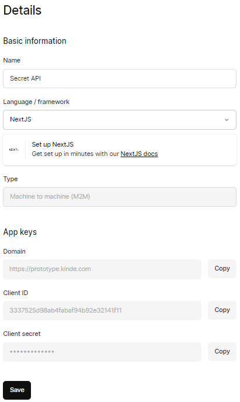
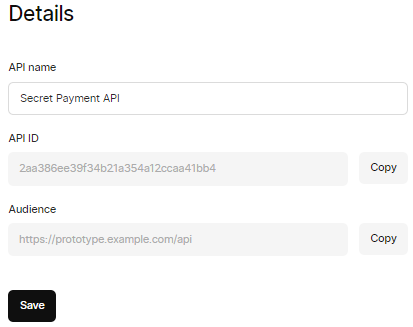
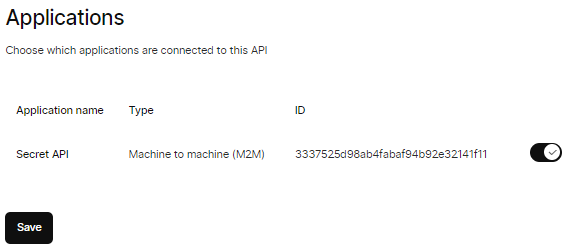

## Before Kinde

1. Define environment variables in `.env.local`

   ```
   KINDE_SITE_URL=http://localhost:3000
   ```

1. Start Next.js in development mode

   ```
   $ npm run dev
   ```

1. Invoke the GET API request

   ```
   $ curl --request GET \
   --url $KINDE_SITE_URL/api/payment/100 \
   --header 'accept: application/json'
   {"message":"GET Success 100"}
   ```

1. Invoke the POST API request

   ```
   curl --request POST \
   --url $KINDE_SITE_URL/api/payment/379 \
   --header 'accept: application/json'
   {"message":"POST Success 379"}
   ```

## Create a Kinde machine-to-machine application

1. Create a machine-to-machine (M2M) application in Kinde

   

1. Define environment variables in `.env.local`

   ```
   KINDE_SITE_URL=http://localhost:3000
   KINDE_CLIENT_ID=3337525d98ab4fabaf94b92e32141f11
   KINDE_CLIENT_SECRET=
   KINDE_ISSUER_URL=https://prototype.kinde.com
   ```

1. Register an API in Kinde

   

1. Activate the API for M2M application

   

1. Define environment variables in `.env.local`

   ```
   KINDE_SITE_URL=http://localhost:3000
   KINDE_CLIENT_ID=3337525d98ab4fabaf94b92e32141f11
   KINDE_CLIENT_SECRET=...
   KINDE_ISSUER_URL=https://prototype.kinde.com
   KINDE_AUDIENCE=https://prototype.example.com/api
   ```

   and this is complete content of `.env.local`.

1. Install NextJS App Router SDK

   ```bash
   $ npm i @kinde-oss/kinde-auth-nextjs
   ```

1. Set up Kinde authentication route handler

   ```javascript
   // app/api/auth/[kindeAuth]/route.js
   import { handleAuth } from "@kinde-oss/kinde-auth-nextjs/server";

   export const GET = handleAuth();
   ```

1. Protect the payment route handler using middleware

   ```javascript
   import { withAuth } from "@kinde-oss/kinde-auth-nextjs/middleware";

   export default middleware = (req) => withAuth(req);

   export const config = {
     matcher: ["/api/payment/:path*"],
   };
   ```

1. Start Next.js in development mode

   ```
   $ npm run dev
   ```

1. Obtain the access token

   ```bash
   $ curl --request POST \
   --url https://prototype.kinde.com/oauth2/token \
   --header 'content-type: application/x-www-form-urlencoded' \
   --header 'accept: application/json' \
   --data grant_type=client_credentials \
   --data client_id=3337525d98ab4fabaf94b92e32141f11 \
   --data client_secret=... \
   --data audience=https://prototype.example.com/api
   ```

   Copy the access token from the JSON response and assign to `ACCESS_TOKEN` variable.

   ```bash
   $ ACCESS_TOKEN=eyJhbGciOiJSUzI1Ni...1V2nMbPOtVjsfOEsOgtrozEdQVLO-bynNnJwhzorwX4_9AIR4ugbsrwQ
   ```

1. Send a request to the protected payment API together with the access token

   ```bash
   $ curl --request GET \
   --url 'http://localhost:3000/api/payment/100' \
   --header 'accept: application/json' \
   --header "authorization: Bearer $ACCESS_TOKEN" \
   --location
   ```

   AND it failed with 500 internal server error
